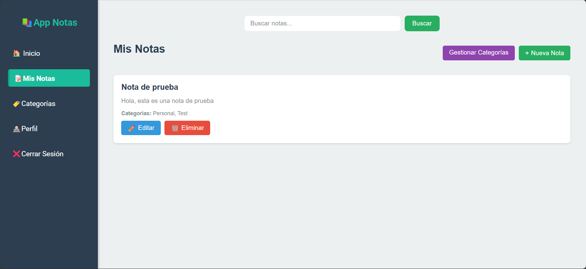
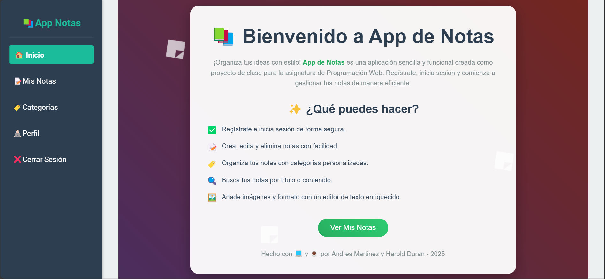

# 📝 App de Notas - Proyecto de Clase

  

## 📖 Descripción

**App de Notas** es un proyecto de clase desarrollado como parte de la asignatura de programacion web. Es una aplicación sencilla pero funcional que permite a los usuarios registrarse, iniciar sesión, y gestionar sus notas personales. Los usuarios pueden crear, editar, eliminar y buscar notas, así como organizarlas por categorías. La aplicación está construida con **Django** y utiliza una interfaz limpia y moderna para una experiencia de usuario agradable.

Este proyecto fue creado para aprender y aplicar conceptos básicos de desarrollo web, como la autenticación de usuarios, el manejo de bases de datos relacionales, y el diseño de interfaces responsivas.

---

## ✨ Características

- **Autenticación de usuarios**: Registro e inicio de sesión seguros.
- **Gestión de notas**: Crear, editar, eliminar y ver detalles de notas.
- **Categorías**: Organiza tus notas con categorías personalizadas o predeterminadas.
- **Búsqueda**: Busca notas por título o contenido.
- **Interfaz amigable**: Diseño limpio y moderno con una barra lateral de navegación.
- **Editor de texto enriquecido**: Usa CKEditor para agregar contenido con formato a tus notas.
- **Imágenes**: Sube imágenes a tus notas para personalizarlas.

---

## 🛠️ Tecnologías utilizadas

- **Backend**: Django 4.2, Python 3.11
- **Frontend**: HTML, CSS, JavaScript
- **Base de datos**: SQLite (por defecto)
- **Librerías**:
  - `django-ckeditor`: Para el editor de texto enriquecido.
  - `Pillow`: Para el manejo de imágenes.

---

## 📸 Capturas de pantalla

| Página de Notas | Página de Inicio |
|-----------------|------------|
|  |  |

---

## 🤝 Contribuciones

Este es un proyecto de clase, por lo que no está abierto a contribuciones externas. Sin embargo, si tienes sugerencias o ideas, ¡siéntete libre de compartirlas en la sección de *Issues*! 😊

---

*Hecho con 💻 y ☕ por [Andres Martinez y Harold Duran] para un proyecto de clase - 2025.*

---
